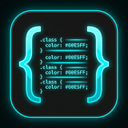

# CSS2USE 🎨🚀



## O que o projeto faz (What the project does)
O **CSS2USE** é uma poderosa Extensão do Google Chrome que injeta um Painel Inspetor flutuante e responsivo (construído com React e Shadcn UI) diretamente em qualquer site que você visitar. Ele permite que você passe o mouse e selecione qualquer elemento DOM da tela para extrair instantaneamente toda a sua estrutura HTML e sua estilização CSS completa (incluindo todas as lógicas de `@media queries` e regras base do CSS).

## Por que o projeto é útil (Why the project is useful)
Desenvolvedores Front-end e UI Designers perdem horas incontáveis inspecionando o Chrome DevTools manualmente, classe por classe, tentando "copiar e colar" um botão ou um card inspirador. O CSS2USE automatiza esse roubo visual 100%:
- Ele captura a árvore inteira de layout de forma fiel.
- Ele não sofre interferência do estilo do site nativo pois se isola dentro de um **Shadow DOM** protegido.
- Ele permite que você congele um elemento na tela e edite seu código HMTL em tempo real.
- Ele possui a função de **Exportação em 1 Clique para o CodePen**, para que você pegue aquele componente maneiro de um site e já comece a alterá-lo no seu próprio ambiente imediatamente!

## Como começar a usar (How users can get started with the project)
1. Clone este repositório para o seu computador.
2. Abra o terminal na pasta e instale as dependências Node:
   ```bash
   npm install
   ```
3. Gere o pacote de produção otimizado para o navegador:
   ```bash
   npm run build
   ```
4. Abra o seu Google Chrome e acesse `chrome://extensions/`.
5. Ative o **Modo do Desenvolvedor (Developer mode)** no canto superior direito.
6. Clique no botão **Carregar sem compactação (Load unpacked)** e selecione a pasta `dist/` que foi gerada dentro do seu projeto.
7. Abra qualquer site, recarregue a página (F5) e clique no ícone da extensão do CSS2USE no topo para começar a garimpar os componentes!

*(Para desenvolvimento contínuo da UI da extensão, rode `npm run dev` para ativar o Hot Reload sem precisar ficar reinstalando a extensão toda hora).*

## Onde conseguir ajuda (Where users can get help with your project)
Se você encontrar algum bug onde a extensão não consegue capturar o CSS de um site altamente ofuscado, ou se tiver dúvidas sobre como instalar:
- Abra uma nova **Issue** no repositório oficial relatando o problema.
- Deixe comentários anexando a URL (link) do site em que a extensão falhou para analisarmos o DOM problemático!

## Quem mantém e contribui (Who maintains and contributes to the project)
O CSS2USE foi conceituado inicialmente com JS Puro e atualizado para uma arquitetura moderna agressiva (React 18 + Vite + Tailwind CSS) por seu criador oficial. Contribuições são imensamente desejadas! Sinta-se livre para dar um Fork no repositório, melhorar o motor de extração regex de CSS ou adicionar novos componentes da interface Shadcn, e enviar o seu Pull Request.
